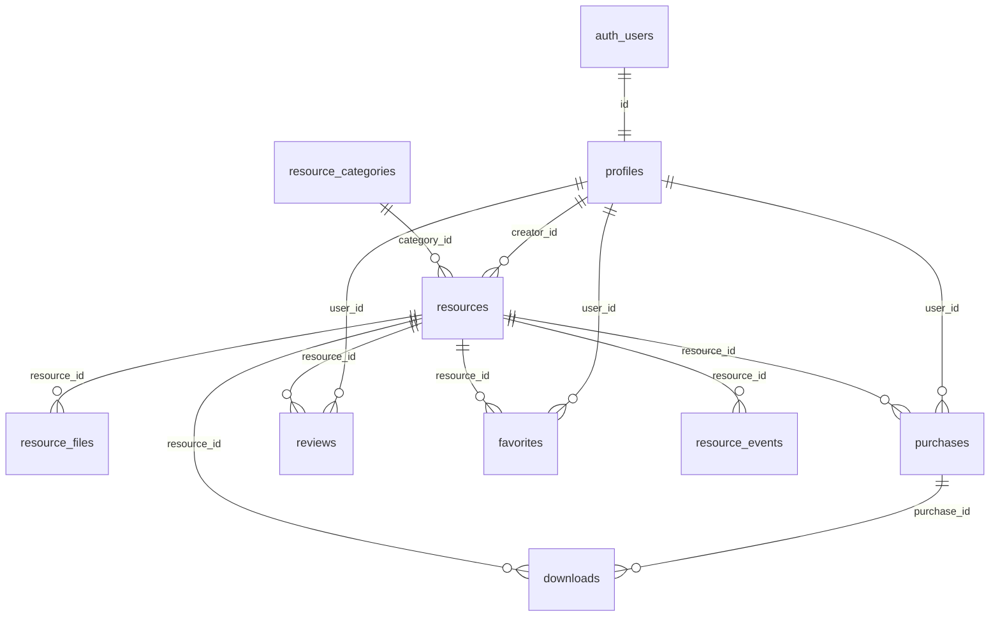

# Resources Marketplace — Backend Architecture

Production schema lives in:

- `supabase/migrations/007_resources_marketplace.sql` — tables, RLS, RPC, triggers
- `supabase/migrations/008_resources_storage.sql` — buckets & storage policies
- `supabase/seed-resources.sql` — sample categories, resources, file metadata

## Entity relationship



## Tables

| Table | Purpose |
|--------|---------|
| `profiles` | User identity, roles (`admin`, `creator`, `customer`) |
| `resource_categories` | Taxonomy (slug, icon, order) |
| `resources` | Products (pricing, SEO, aggregates, full-text search) |
| `resource_files` | Private file metadata (`resource-files` bucket) |
| `purchases` | Paid transactions |
| `downloads` | Audit log + rate limiting |
| `reviews` | Ratings (moderated via `approved`) |
| `favorites` | Wishlist |
| `newsletters` | Email capture |
| `resource_events` | Views / analytics granularity |

## Auth flow

1. User signs up via **Email** or **Google** (enable in Supabase Dashboard → Authentication).
2. Trigger `on_auth_user_created` → `handle_new_user()` inserts `profiles` row.
3. If email is listed in `site_settings.marketplace_admin_emails` (comma-separated), role = `admin`.
4. Otherwise role = `customer`. Promote creators manually: `update profiles set role = 'creator' where id = '…'`.

**CMS note:** Portfolio CMS still uses `authenticated` = admin for `hero`, `projects`, etc. Marketplace uses **role-based** `profiles.role`. A user can be CMS admin (any logged-in CMS user) and marketplace `customer` until promoted.

## Marketplace logic

| Action | Flow |
|--------|------|
| **Free download** | `user_can_access_resource` → `record_resource_download` → client `createSignedUrl` (or anon policy for free files) |
| **Paid purchase** | `create_resource_purchase` (pending) → Stripe webhook → `complete_resource_purchase` (service role) |
| **Access check** | Free + published = anyone; paid = completed purchase or admin |
| **Rate limit** | `max_downloads_per_day` per resource, counted in `downloads` last 24h |
| **Reviews** | Requires access; `approved = false` until admin moderates |
| **Favorites** | Authenticated only, unique per user/resource |

## Storage architecture

| Bucket | Public | Purpose |
|--------|--------|---------|
| `resource-previews` | Yes | Thumbnails, gallery (`{resource_id}/…`) |
| `resource-files` | No | ZIPs, source files (`{resource_id}/{version}/{filename}`) |
| `user-avatars` | Yes | Profile images (`{user_id}/…`) |

### Signed URL strategy

1. Client calls `get_downloadable_files(resource_id)` (RPC validates access).
2. Client calls `record_resource_download` (logs + increments count).
3. Client calls `storage.createSignedUrl(bucket, path, 120)` **or** Edge Function with service role for hardened delivery.

**Edge case — anonymous free downloads:** RLS allows anon `SELECT` on `resource-files` only when `pricing_type = 'free'`. Paid assets never exposed to anon.

**Edge case — paid without login:** `create_resource_purchase` requires `auth.uid()`. Guest checkout = extend `purchases.buyer_email` + magic link (future).

## Security model

| Risk | Mitigation |
|------|------------|
| Direct file URL guessing | Private bucket; path includes UUID; signed URLs short TTL |
| Bypass purchase | `user_can_access_resource` in RPC + storage RLS |
| Download flooding | Per-resource daily cap in `record_resource_download` |
| Review spam | Must own access; moderation flag |
| Role escalation | `profiles` update policy blocks `role` changes |
| Webhook forgery | `complete_resource_purchase` only `service_role` |
| PII in downloads | `ip_address` / `user_agent` optional; restrict admin read |

## Performance

- **Indexes:** status + published_at, featured, category, GIN on `search_vector` and `tags`, trigram on `title`
- **Search:** `search_resources()` RPC with `websearch_to_tsquery` + pagination (`limit`/`offset`)
- **Aggregates:** `download_count`, `view_count`, `rating_*` maintained by triggers
- **View:** `published_resources` for thin storefront queries (`security_invoker`)

## Admin / creator dashboard (schema-ready)

| Feature | Source |
|---------|--------|
| Resource moderation | `resources.status`, `reviews.approved` |
| Revenue | `purchases` where `payment_status = 'completed'` |
| Analytics | `resource_events`, `downloads`, `view_count` |
| User management | `profiles` (admin policy) |

Use `fetchCreatorDashboard()` in `src/lib/resources/api.js`.

## Recommended folder structure

```
supabase/
  migrations/
    007_resources_marketplace.sql
    008_resources_storage.sql
  seed-resources.sql
  functions/
    sign-resource-download/   # optional Edge Function
src/
  types/marketplace.database.ts
  lib/resources/api.js
docs/
  resources-marketplace-architecture.md
  resources-api-examples.md
```

## Deploy

```bash
npm run supabase:db-push
npm run supabase:seed-resources
```

Migration `009_marketplace_cms_admin.sql` grants the same **authenticated CMS login** full access to shop tables and storage uploads (no separate marketplace role required for the studio admin).

## Admin CMS

| Route | Purpose |
|-------|---------|
| `/admin/shop/resources` | List, publish, feature, delete products |
| `/admin/shop/resources/new` | Create resource + upload previews |
| `/admin/shop/categories` | Category CRUD + order |
| `/admin/shop/profiles` | User roles (customer / creator / admin) |
| `/admin/shop/reviews` | Approve / reject reviews |
| `/admin/shop/purchases` | Sales log + revenue summary |
| `/admin/shop/newsletter` | Subscriber emails |

Public `/resources` loads published rows from Supabase; falls back to mock data if the table is empty.

Set `site_settings.marketplace_admin_emails` to your admin email(s).

Enable Google provider in Supabase Auth if using `signInWithGoogle()`.

## Stripe webhook (outline)

1. Checkout session includes `purchase_id` metadata.
2. Edge Function verifies Stripe signature.
3. `supabaseAdmin.rpc('complete_resource_purchase', { p_purchase_id })`.

Never expose service role key to the browser.
